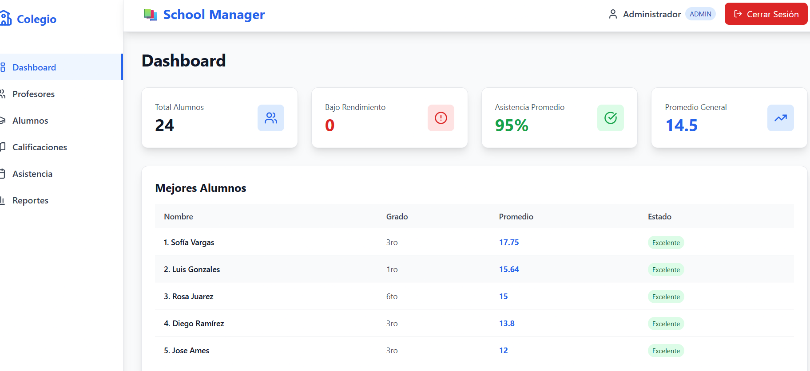
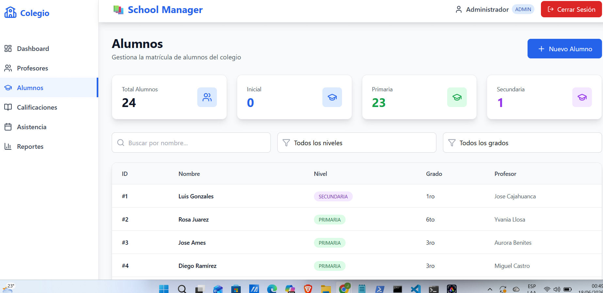
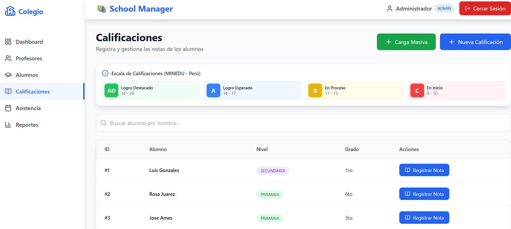
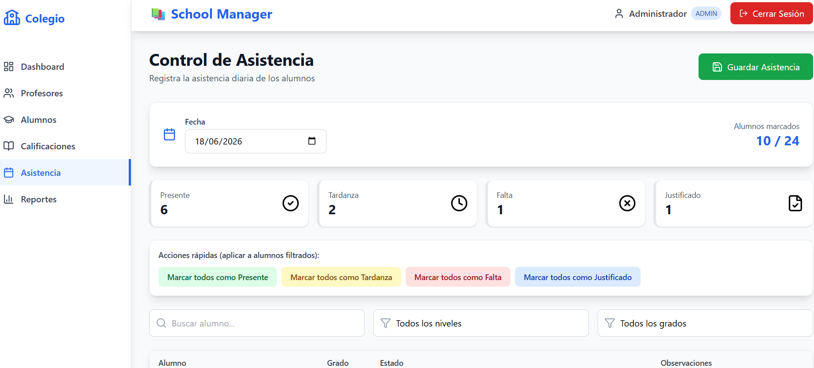
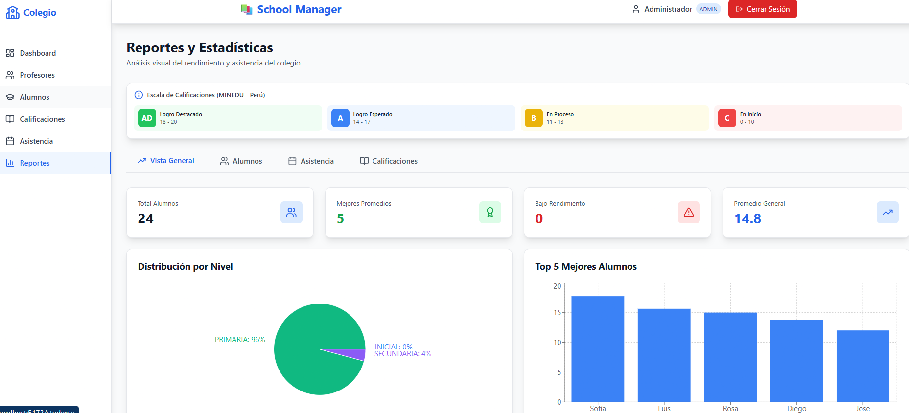

# 🎓 Sistema de Gestión Escolar - Versión 1.0

Sistema completo de gestión escolar desarrollado con **FastAPI** (backend) y **React + Vite + TailwindCSS** (frontend). Diseñado para colegios en Perú, cumpliendo con los estándares del MINEDU.


## 📋 Tabla de Contenidos

- [Características](#-características)
- [Tecnologías](#-tecnologías)
- [Estructura del Proyecto](#-estructura-del-proyecto)
- [Instalación](#-instalación)
- [Configuración](#-configuración)
- [Uso](#-uso)
- [API Endpoints](#-api-endpoints)
- [Sistema de Calificaciones](#-sistema-de-calificaciones-perú-minedu)
- [Capturas de Pantalla](#-capturas-de-pantalla)
- [Roadmap](#-roadmap)
- [Contribuciones](#-contribuciones)
- [Licencia](#-licencia)

---

## ✨ Características

### 🔐 Autenticación y Seguridad

- ✅ Autenticación JWT (JSON Web Tokens)
- ✅ Roles de usuario: Administrador, Profesor, Padre
- ✅ Protección de endpoints por roles
- ✅ Contraseñas encriptadas con bcrypt
- ✅ Tokens con expiración configurable (8 horas por defecto)

### 👨‍🏫 Gestión de Profesores

- ✅ Registro individual y masivo de profesores
- ✅ Asignación de materias
- ✅ Listado con búsqueda
- ✅ Vinculación con usuarios del sistema

### 👨‍🎓 Gestión de Alumnos

- ✅ Matrícula individual y masiva
- ✅ Clasificación por niveles: Inicial, Primaria, Secundaria
- ✅ Asignación a profesores tutores
- ✅ Filtros por nivel y grado
- ✅ Búsqueda por nombre

### 📝 Gestión de Calificaciones

- ✅ Registro individual y masivo de notas
- ✅ **Sistema de calificaciones peruano (MINEDU)**:
  - **AD** (18-20): Logro Destacado
  - **A** (14-17): Logro Esperado
  - **B** (11-13): En Proceso
  - **C** (0-10): En Inicio
- ✅ Conversión automática de nota numérica a literal
- ✅ Validación de notas (0-20)
- ✅ Períodos: Bimestre 1, 2, 3, 4
- ✅ 19 materias predefinidas

### 📅 Control de Asistencia

- ✅ Registro diario de asistencia
- ✅ 4 estados: Presente, Tardanza, Falta, Justificado
- ✅ Marcado masivo por aula
- ✅ Observaciones por alumno
- ✅ Estadísticas en tiempo real
- ✅ Historial por alumno y por fecha

### 📊 Reportes y Estadísticas

- ✅ Dashboard con métricas clave
- ✅ Gráficos interactivos (Recharts):
  - Distribución por nivel educativo
  - Top 5 mejores alumnos
  - Distribución de asistencia
  - Promedios de calificaciones
- ✅ Ranking de mejores alumnos
- ✅ Alerta de alumnos con bajo rendimiento
- ✅ Análisis de asistencia mensual
- ✅ Distribución de literales (AD, A, B, C)

### 🎨 Frontend Profesional

- ✅ Interfaz moderna con React 18
- ✅ Diseño responsive con TailwindCSS
- ✅ Navegación intuitiva
- ✅ Modales para formularios
- ✅ Notificaciones visuales
- ✅ Iconos con Lucide React
- ✅ Carga masiva tipo Excel

---

## 🛠️ Tecnologías

### Backend

| Tecnología      | Versión   | Descripción                     |
| --------------- | --------- | ------------------------------- |
| **FastAPI**     | 0.109.0   | Framework web moderno y rápido  |
| **SQLAlchemy**  | 2.0.25    | ORM para base de datos          |
| **Pydantic**    | 2.5.3     | Validación de datos             |
| **SQLite**      | -         | Base de datos ligera            |
| **python-jose** | 3.3.0     | Manejo de JWT                   |
| **passlib**     | 1.7.4     | Encriptación de contraseñas     |
| **bcrypt**      | **4.0.1** | ⚠️ Versión específica requerida |
| **Uvicorn**     | 0.27.0    | Servidor ASGI                   |

### Frontend

| Tecnología       | Versión   | Descripción             |
| ---------------- | --------- | ----------------------- |
| **React**        | 18        | Biblioteca UI           |
| **Vite**         | 5.x       | Build tool ultrarrápido |
| **TailwindCSS**  | **3.4.1** | ⚠️ v3 (no v4)           |
| **Axios**        | 1.6.x     | Cliente HTTP            |
| **React Router** | 6         | Navegación              |
| **Recharts**     | 2.x       | Gráficos interactivos   |
| **Lucide React** | 0.x       | Iconos modernos         |

---

## 📁 Estructura del Proyecto

```
school-api/
├── main.py                      # Punto de entrada FastAPI + CORS
├── database.py                  # Configuración de base de datos
├── models.py                    # Modelos SQLAlchemy
├── schemas.py                   # Esquemas Pydantic
├── dependencies.py              # Funciones de seguridad y JWT
├── colegio.db                   # Base de datos SQLite (auto-generada)
├── requirements.txt             # Dependencias Python
│
├── routers/                     # Endpoints organizados por módulo
│   ├── __init__.py
│   ├── auth.py                  # Autenticación y usuarios
│   ├── teachers.py              # Gestión de profesores
│   ├── students.py              # Gestión de alumnos
│   ├── grades.py                # Calificaciones
│   ├── attendance.py            # Control de asistencia
│   └── reports.py               # Reportes y estadísticas
│
├── scripts/                     # Scripts auxiliares
│   ├── crear_admin.py           # Crear usuario admin
│   ├── registrar_usuarios.py    # Registro masivo de usuarios
│   ├── cargar_colegio.py        # Carga inicial de datos
│   └── ver_usuarios.py          # Ver usuarios registrados
│
├── frontend/                    # Aplicación React
│   ├── src/
│   │   ├── components/
│   │   │   ├── Navbar.jsx       # Barra de navegación
│   │   │   ├── Sidebar.jsx      # Menú lateral
│   │   │   └── ProtectedRoute.jsx
│   │   ├── pages/
│   │   │   ├── Login.jsx        # Página de login
│   │   │   ├── Dashboard.jsx    # Panel principal
│   │   │   ├── Teachers.jsx     # Gestión de profesores
│   │   │   ├── Students.jsx     # Gestión de alumnos
│   │   │   ├── Grades.jsx       # Calificaciones
│   │   │   ├── Attendance.jsx   # Asistencia
│   │   │   └── Reports.jsx      # Reportes
│   │   ├── services/
│   │   │   └── api.js           # Configuración Axios
│   │   ├── context/
│   │   │   └── AuthContext.jsx  # Contexto de autenticación
│   │   ├── App.jsx              # Componente principal
│   │   ├── main.jsx             # Punto de entrada React
│   │   └── index.css            # Estilos globales + Tailwind
│   ├── package.json
│   ├── tailwind.config.js
│   └── vite.config.js
│
└── README.md                    # Este archivo
```

---

## 🚀 Instalación

### Requisitos Previos

- **Python 3.10** o superior (probado con 3.14)
- **Node.js 18** o superior
- **npm** o **yarn**

### 1. Clonar o Descargar el Repositorio

```bash
git clone <url-del-repositorio>
cd school-api
```

### 2. Configurar Backend

```bash
# Crear entorno virtual (recomendado)
python -m venv venv

# Activar entorno virtual
# Windows:
venv\Scripts\activate
# Linux/Mac:
source venv/bin/activate

# Instalar dependencias
pip install -r requirements.txt

# ⚠️ IMPORTANTE: Instalar versión específica de bcrypt
pip install bcrypt==4.0.1
```

> **Nota:** La versión de bcrypt debe ser **4.0.1** para ser compatible con `passlib`. Versiones superiores (4.1+) causan errores.

### 3. Configurar Frontend

```bash
cd frontend

# Instalar dependencias
npm install

# ⚠️ IMPORTANTE: Usar TailwindCSS v3 (no v4)
npm install -D tailwindcss@3.4.1 postcss@8.4.33 autoprefixer@10.4.17
npx tailwindcss init -p
```

### 4. Crear Usuario Administrador

```bash
# Desde la raíz del proyecto (con el backend corriendo)
python scripts/crear_admin.py
```

**Credenciales por defecto:**

- **Usuario**: `admin`
- **Contraseña**: `admin123`

---

## ⚙️ Configuración

### Variables Importantes

Las variables de configuración están definidas directamente en el código:

**Backend** (`dependencies.py`):

```python
SECRET_KEY = "tu_clave_secreta_super_segura_cambiala_en_produccion_123456"
ALGORITHM = "HS256"
ACCESS_TOKEN_EXPIRE_MINUTES = 480  # 8 horas
```

**Backend** (`main.py` - CORS):

```python
allow_origins=["http://localhost:5173", "http://127.0.0.1:5173"]
```

**Frontend** (`src/services/api.js`):

```javascript
const API_URL = "http://127.0.0.1:8000";
```

### ⚠️ Configuración para Producción

Antes de desplegar en producción:

1. Cambia `SECRET_KEY` por una clave segura y única
2. Actualiza `allow_origins` con los dominios reales
3. Cambia `API_URL` a la URL de producción
4. Migra de SQLite a PostgreSQL

---

## 🎯 Uso

### 1. Iniciar Backend

```bash
# Desde la raíz del proyecto
uvicorn main:app --reload
```

- **API**: http://127.0.0.1:8000
- **Documentación Swagger**: http://127.0.0.1:8000/docs

### 2. Iniciar Frontend

```bash
# En otra terminal, desde la carpeta frontend
cd frontend
npm run dev
```

- **Aplicación**: http://localhost:5173

### 3. Acceder al Sistema

1. Abre tu navegador en `http://localhost:5173`
2. Inicia sesión con las credenciales de administrador
3. Explora los diferentes módulos

---

## 🔌 API Endpoints

### Autenticación

| Método | Endpoint         | Descripción                            |
| ------ | ---------------- | -------------------------------------- |
| POST   | `/register`      | Registrar nuevo usuario                |
| POST   | `/register/bulk` | Registro masivo de usuarios            |
| POST   | `/login`         | Iniciar sesión                         |
| GET    | `/me`            | Información del usuario actual         |
| GET    | `/users`         | Listar todos los usuarios (solo ADMIN) |

### Profesores

| Método | Endpoint         | Descripción                  |
| ------ | ---------------- | ---------------------------- |
| POST   | `/teachers/`     | Crear profesor               |
| POST   | `/teachers/bulk` | Crear profesores masivamente |
| GET    | `/teachers/`     | Listar profesores            |

### Alumnos

| Método | Endpoint         | Descripción                    |
| ------ | ---------------- | ------------------------------ |
| POST   | `/students/`     | Matricular alumno              |
| POST   | `/students/bulk` | Matricular alumnos masivamente |
| GET    | `/students/`     | Listar alumnos                 |
| GET    | `/students/{id}` | Ver ficha de alumno            |

### Calificaciones

| Método | Endpoint                   | Descripción                          |
| ------ | -------------------------- | ------------------------------------ |
| POST   | `/grades/?student_id={id}` | Registrar calificación               |
| POST   | `/grades/bulk`             | Registrar calificaciones masivamente |

### Asistencia

| Método | Endpoint                   | Descripción                  |
| ------ | -------------------------- | ---------------------------- |
| POST   | `/attendance/`             | Marcar asistencia individual |
| POST   | `/attendance/bulk`         | Marcar asistencia masiva     |
| GET    | `/attendance/student/{id}` | Historial de alumno          |
| GET    | `/attendance/date/{fecha}` | Asistencia por fecha         |

### Reportes

| Método | Endpoint                           | Descripción                  |
| ------ | ---------------------------------- | ---------------------------- |
| GET    | `/reports/student/{id}/average`    | Promedio de alumno           |
| GET    | `/reports/low-performing-students` | Alumnos con bajo rendimiento |
| GET    | `/reports/top-students`            | Mejores alumnos              |
| GET    | `/reports/attendance-summary`      | Resumen de asistencia        |
| GET    | `/reports/students-by-level`       | Estadísticas por nivel       |
| GET    | `/reports/teacher-students/{id}`   | Alumnos de un profesor       |

---

## 📊 Sistema de Calificaciones (Perú - MINEDU)

El sistema implementa la escala de calificaciones oficial del Ministerio de Educación del Perú:

| Nota  | Literal | Significado     | Color       |
| ----- | ------- | --------------- | ----------- |
| 18-20 | **AD**  | Logro Destacado | 🟢 Verde    |
| 14-17 | **A**   | Logro Esperado  | 🔵 Azul     |
| 11-13 | **B**   | En Proceso      | 🟡 Amarillo |
| 0-10  | **C**   | En Inicio       | 🔴 Rojo     |

### Conversión Automática

El sistema convierte automáticamente las notas numéricas a literales en:

- Módulo de Calificaciones (al registrar notas)
- Módulo de Reportes (en todas las tablas)
- Dashboard (promedios de alumnos)

---

## 📸 Capturas de Pantalla

### 🔐 Login


_Pantalla de inicio de sesión con diseño moderno_

### 📊 Dashboard


_Panel principal con estadísticas clave_

### 👨‍🎓 Gestión de Alumnos


_Lista de alumnos con filtros y búsqueda_

### 📝 Registro de Calificaciones


_Interfaz de registro con conversión automática a literales_

### 📅 Control de Asistencia


_Control diario con marcado masivo_

### 📈 Reportes


_Gráficos interactivos y análisis de rendimiento_

---

## 🗺️ Roadmap

### Versión 2.0 (Próximamente)

- [ ] Exportación de reportes a PDF
- [ ] Notificaciones por email a padres
- [ ] Portal de padres para ver notas de sus hijos
- [ ] Calendario escolar integrado
- [ ] Sistema de comunicación interna
- [ ] Migración a PostgreSQL
- [ ] Deploy en producción (Docker + AWS/Heroku)
- [ ] App móvil (React Native)

### Versiones Futuras

- [ ] Integración con SIAGIE (Sistema peruano)
- [ ] Biblioteca digital
- [ ] Sistema de pagos y pensiones
- [ ] Gestión de recursos educativos
- [ ] Análisis predictivo con IA

---

## 🤝 Contribuciones

Las contribuciones son bienvenidas. Para contribuir:

1. Fork el proyecto
2. Crea una rama para tu feature (`git checkout -b feature/AmazingFeature`)
3. Commit tus cambios (`git commit -m 'Add some AmazingFeature'`)
4. Push a la rama (`git push origin feature/AmazingFeature`)
5. Abre un Pull Request

---

## 📄 Licencia

Este proyecto está bajo la **Licencia de Master Systems JLC**.

Copyright (c) 2026 Jose Luis Cajahuanca - Master Systems JLC

Todos los derechos reservados. El uso de este software está sujeto a los términos y condiciones establecidos por el autor.

---

## 👥 Autor

**Jose Luis Cajahuanca**  
Desarrollador Principal  
📧 Email: kjawank.jose@gmail.com

---

## 🙏 Agradecimientos

- [FastAPI](https://fastapi.tiangolo.com/) - Framework web increíble
- [React](https://reactjs.org/) - Biblioteca UI
- [TailwindCSS](https://tailwindcss.com/) - Framework CSS
- [MINEDU Perú](https://www.gob.pe/minedu) - Estándares de calificación
- Comunidad de desarrolladores

---

## 📞 Soporte

Si tienes preguntas o necesitas ayuda:

- 📧 Email: kjawank.jose@gmail.com
- 🐛 Abre un issue en el repositorio

---

## 🎓 Sobre el Proyecto

Este sistema fue desarrollado como una solución integral para la gestión escolar en colegios peruanos, cumpliendo con los estándares del MINEDU y proporcionando una experiencia de usuario moderna y eficiente.

- **Versión**: 1.0.0
- **Fecha de lanzamiento**: Junio 2026
- **Estado**: ✅ Producción

---

<div align="center">

**Hecho con ❤️ para la educación peruana**

**Master Systems JLC © 2026**

[⬆ Volver arriba](#-sistema-de-gestión-escolar---versión-10)

</div>
